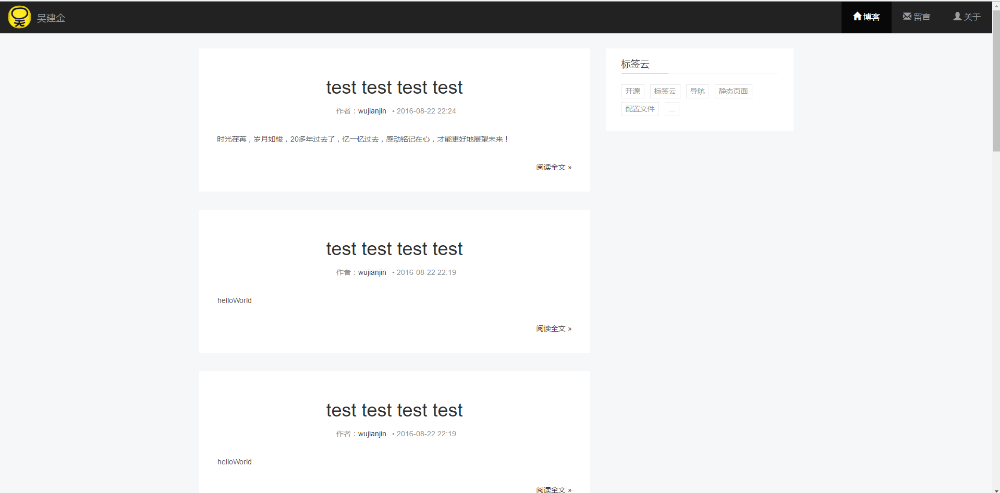
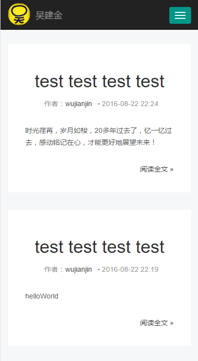

# koa2-blog
一个基于Nodejs koa2的博客; 功能完善中 ^_^！


## Folder structure

```
.
├── bin                         #启动脚本 node ./bin/www
├── config                      #config
├── demo                        #demo
├── log                         #操作日志
├── middlewares                 #自定义中间件
├── models                      #model层
├── public                      #静态资源
├── routes                      #路由层
├── schema                      #schema层
├── services                    #业务层
├── test                        #单元测试
├── utils                       #工具类
└── views                       #视图层

```
## Screenshot


### PC

### Home 


### Topic list


### Topic etail


### Admin


### Public topic


### Mobile


## Features

* support markdown
* comment module     		      //TODO
* message board module  	      //TODO
* support async/await
* support yarn 
* node.js v7.6.0+
* mongoose mongodb ORM module

## Install

    1. git clone https://github.com/mosaic101/koa2-blog.git
    2. cd koa2-blog
    3. npm install or yarn install
    4. npm start
    5. http://localhost:4000
    6. need to install mongoDB and start mongoDB

## Notice
    1. 依赖node.js v7.6.0+ (Koa requires node v7.6.0 or higher for ES2015 and async function support.)
    2. async/await 函数是es7的特性,async函数里使用await可以做到和yield类似的效果，但await只能接受promise对象
    3. 用bluebird替换原生Promise,blurbird的性能是V8里内置的Promise 3倍左右bluebird 的优化方式见 https://github.com/petkaantonov/bluebird/wiki/Optimization-killers ）。

## PS
=====
    1. 觉得有帮助的顺手给颗星，十分谢谢！
    2. 欢迎大家提宝贵意见！
